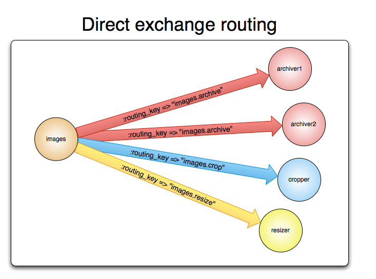

# 什么是AMQP 0-9-1

AMQP 0-9-1（高级消息队列协议）是一种消息传递协议，使客户端应用程序能够与消息中间件代理进行通信。

# 代理

消息代理接受来自发布者（发布消息的应用程序，也叫生产者）的消息并把它们路由到消费者（处理消息的应用程序）。

因为它是一个网络协议，所以发布者、消费者和代理都能部署在不同机器上。

# AMQP 0-9-1模型简介

AMQP 0-9-1模型如下：消息被发布到交换机（就像邮政局或邮箱）中，然后使用称为绑定（bindings）的规则分发消息副本到队列（queues）。然后，代理将消息传递给订阅队列的消费者，或者消费者按需从队列中获取消息。

发布消息时，发布者可以定义各种消息属性（消息元数据）。其中一些元数据可以被代理使用，但是它的其余部分对代理完全不透明，并且仅被接收消息的应用程序使用。

网络是不可靠的，并且应用程序可能无法处理消息，因此AMQP 0-9-1模型具有*消息确认*（*message acknowledgements*）的概念：当消息被传递给消费者时，消费者会自动通知代理（如果应用程序开发人员选择这样做）。当使用消息确认机制时，在收到该消息（或消息组）的通知时，代理才会完全从队列中删除该消息。

在某些情况下，例如，当无法路由消息时，可以将消息返回给发布者、丢弃，或者，如果代理实现了扩展，则将这些消息推到所谓的“死信队列（dead letter queue）”中。发布者通过使用某些参数发布消息来选择如何处理这样的情况。

队列（Queues），交换（exchanges）和绑定（bindings）称为AMQP实体。

# AMQP 0-9-1是可编程协议

AMQP 0-9-1是一种可编程协议，即AMQP 0-9-1实体和路由规则主要由应用程序本身定义，而不是代理管理员。

因此，为协议操作定义了一系列规则如声明队列和交换机、定义他们之间的绑定、订阅队列等。

这给了应用程序开发人员很多自由，但也需要他们意识到潜在的定义冲突。在实践中，定义冲突是罕见的，并且通常表明存在错误配置。

应用程序声明所需的AMQP 0-9-1实体，定义必要的路由规则，并且可以在不再使用它们时删除AMQP 0-9-1实体。

# 交换机和交换类型

消息会发送到交换机，交换机是AMQP 0-9-1实体。交换传递消息，将其路由到零或多个队列中。使用的路由算法取决于交换类型和被称为绑定的规则。AMQP 0-9-1代理提供四种交换类型：

| Exchange type             | Default pre-declared names              |
| :------------------------ | :-------------------------------------- |
| Direct exchange直连交换机 | (Empty string) and amq.direct           |
| Fanout exchange扇形交换机 | amq.fanout                              |
| Topic exchange主题交换机  | amq.topic                               |
| Headers exchange头交换机  | amq.match (and amq.headers in RabbitMQ) |

除了交换类型之外，交换机还声明了许多属性，最重要的是：

- Name：交换机名称
- Durability (exchanges survive broker restart)：是否持久化。如果持久性，则代理重启后，交换机还存在
- Auto-delete (exchange is deleted when last queue is unbound from it)：当所有与之绑定的消息队列都完成了对此交换机的使用后，删掉它
- Arguments (optional, used by plugins and broker-specific features)：可选，插件和代理特定功能使用

交换机可以是持久化的或临时的。持久化的交换机在代理重新启动任然存在，而临时的不会（当代理重新在线时，他们必须被重新声明）。并非所有场景都需要持久化的交换机。

# 默认交换机

默认交换机是代理预先声明的没有名称（空字符串）的直连交换机。它有一个特殊的属性，非常适用于简单的应用程序：创建的每个队列都是用与队列名称相同的路由key自动绑定到该类交换机。

例如，当声明一个名为为“search-indexing-online”的队列时，AMQP 0-9-1代理将使用“search-indexing-online”作为路由key将其绑定到默认交换机（在此上下文有时称为绑定key）。因此，发布到默认交换机的路由key为“search-indexing-online”的消息将被路由到队列“search-indexing-online”。换句话说，默认交换使其似乎可以直接向队列传递消息。

# 直连交换机

直连交换机基于消息路由key将消息传递到队列。直连交换机非常适合消息的单播路由（尽管它们也可用于组播路由）。下面是它的工作原理：

- 队列通过路由key K绑定到交换机
- 当具有路由key R的新消息到达直接交换机时，如果K = R，则交换机将其路由到该队列

直接交换机通常用于以循环方式在多个工作实例（相同应用程序的实例）之间分配任务。这样做时，重要的是要理解，在AMQP 0-9-1中，消息是在消费者之间负载均衡，而不是在队列之间负载均衡。

直接交换机可以以图形方式表示如下：

# 扇形交换机

扇形交换机不管绑定的key是什么，会路由消息到绑定到它的所有队列。如果N个队列绑定到扇形交换机，则当新消息发布到该交换机时，它将传递消息的副本到这N个队列。扇形交换机适合广播路由。

因为扇形交换机将消息的副本传递给绑定到它的每个队列，所以它的使用场景非常相似：

- 大型多人在线（MMO）游戏可以将其用于排行榜更新或其他全局事件
- 体育新闻网站可以使用扇形交换机实时地发布更新的分数到移动客户端
- 分布式系统可以广播各种状态和配置更新
- 群组聊天可以使用扇形交换机分发参与者之间的消息（虽然AMQP没有内置的相关概念，所以XMPP可能是一个更好的选择）

扇形交换机可以以图形方式表示如下：

# 主题交换机

主题交换机基于消息路由key和用于将队列绑定到交换机的模式之间的匹配，将消息路由到一个或多个队列。主题交换机通常用于实现各种发布/订阅模式变体。主题交换机通常用于消息的组播路由。

主题交换机具有非常广泛的使用场景。当一个问题涉及多个消费者/应用程序有选择性地接收哪种类型的消息时，应考虑使用主题交换机。

使用案例：

- 分发与特定地理位置相关的数据，例如销售点

- 由多个工作实例处理的后台任务，每个工作实例都能够处理特定的任务集
- 库存价格更新（以及其他类型的财务数据更新）
- 涉及分类或标记的新闻更新（例如，仅适用于特定运动或团队）
- 不同类型云服务的编排
- 分布式架构/操作系统的软件构建或打包，其中每个构建器只能处理一个架构或操作系统

# 头交换机